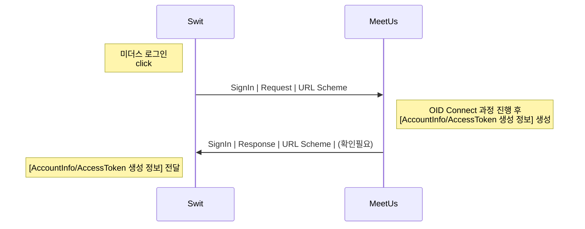
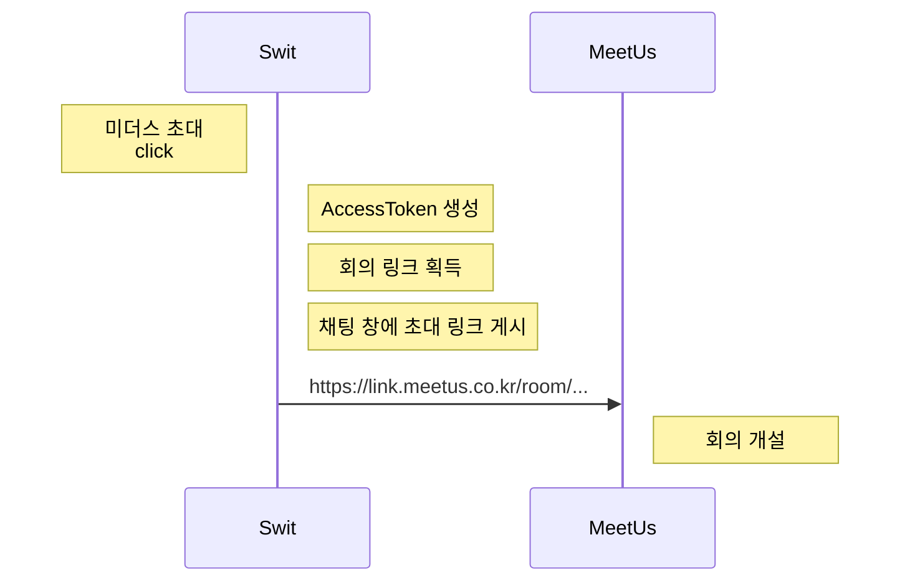
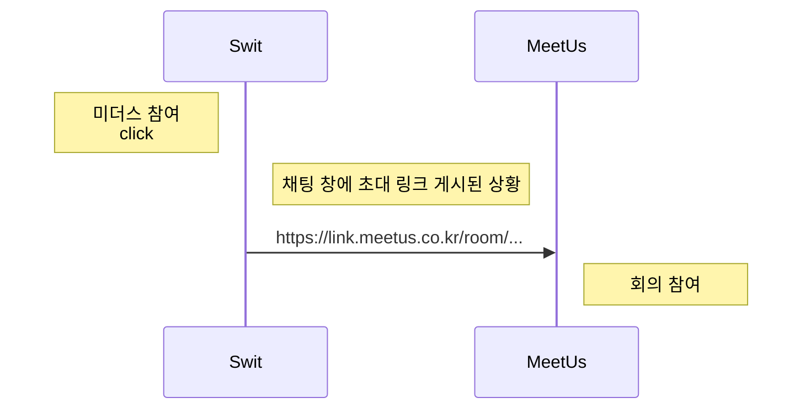
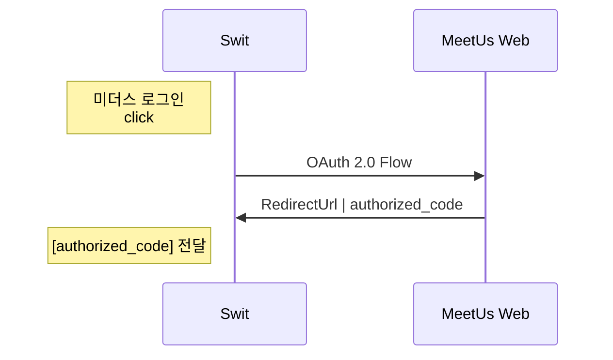
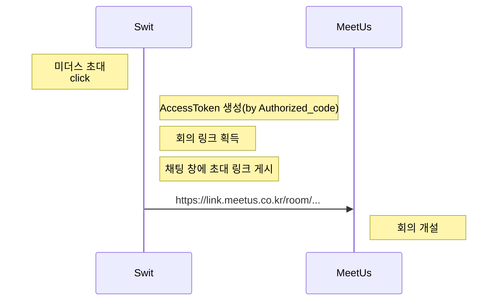
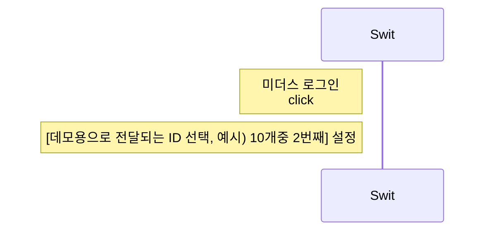
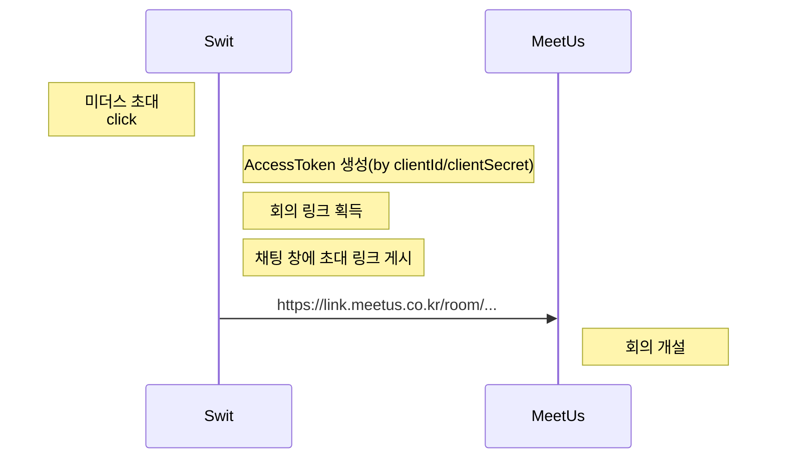

```mermaid
sequenceDiagram
Note left of Swit: 미더스 로그인<br/>click
Swit ->> MeetUs: SignIn | Request | URL Scheme
Note right of MeetUs: OID Connect 과정 진행 후<br/>[AccountInfo/AccessToken 생성 정보] 생성
MeetUs->>Swit: SignIn | Response | URL Scheme | (확인필요)
Note left of Swit:[AccountInfo/AccessToken 생성 정보] 전달
```

```mermaid
sequenceDiagram
Note left of Swit: 미더스 초대<br/>click
Note right of Swit: AccessToken 생성
Note right of Swit: 회의 링크 획득
Note right of Swit: 채팅 창에 초대 링크 게시
Swit ->> MeetUs: https://link.meetus.co.kr/room/...
Note right of MeetUs: 회의 개설
```

```mermaid
sequenceDiagram
Note left of Swit: 미더스 참여<br/>click
Note right of Swit: 채팅 창에 초대 링크 게시된 상황
Swit ->> MeetUs: https://link.meetus.co.kr/room/...
Note right of MeetUs: 회의 참여
```

```mermaid
sequenceDiagram
Note left of Swit: 미더스 로그인<br/>click
Swit ->> MeetUs Web: OAuth 2.0 Flow
MeetUs Web->>Swit: RedirectUrl | authorized_code
Note left of Swit:[authorized_code] 전달
```

```mermaid
sequenceDiagram
Note left of Swit: 미더스 초대<br/>click
Note right of Swit: AccessToken 생성(by Authorized_code)
Note right of Swit: 회의 링크 획득
Note right of Swit: 채팅 창에 초대 링크 게시
Swit ->> MeetUs: https://link.meetus.co.kr/room/...
Note right of MeetUs: 회의 개설
```

```mermaid
sequenceDiagram
Note left of Swit: 미더스 로그인<br/>click
Note left of Swit:[데모용으로 전달되는 ID 선택, 예시) 10개중 2번째] 설정
```

```mermaid
sequenceDiagram
Note left of Swit: 미더스 초대<br/>click
Note right of Swit: AccessToken 생성(by clientId/clientSecret)
Note right of Swit: 회의 링크 획득
Note right of Swit: 채팅 창에 초대 링크 게시
Swit ->> MeetUs: https://link.meetus.co.kr/room/...
Note right of MeetUs: 회의 개설
```
