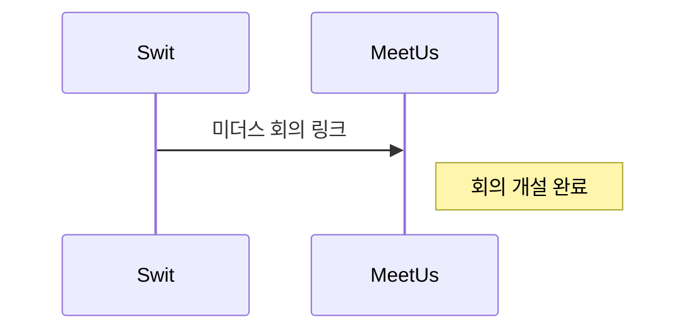
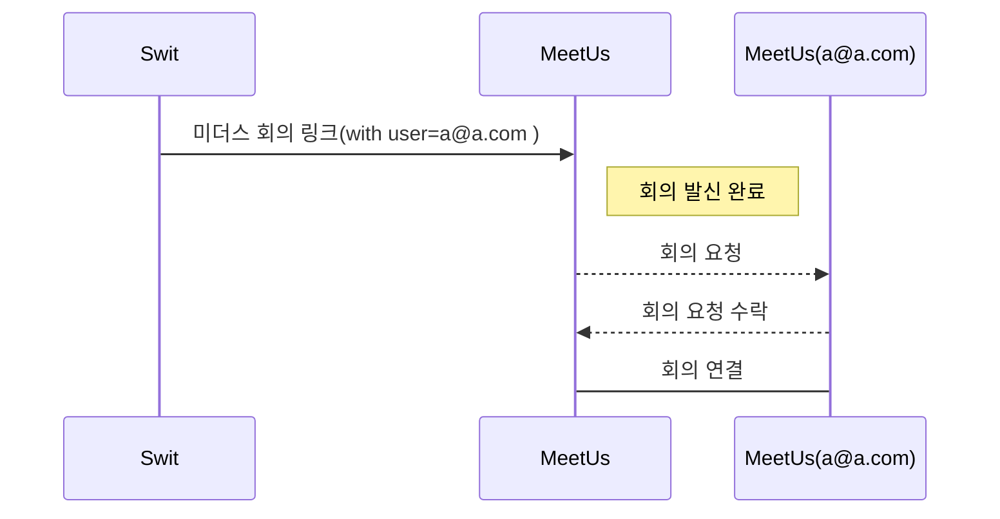

# 미더스 URLScheme 연동 가이드 v1.0

모바일 애플리케이션 및 브라우저에서 미더스 앱을 통해, **회의 개설 및 회의 발신**을 위해, 회의 링크 API를 호출하고, 해당 URL을 통해,  기능을 수행할 수 있습니다.

## 회의 링크 조회
**API 서버 호출 규격을 참고하세요(서버규격)**

## 회의 개설
획득한 회의 URL 선택시, 링크 페이지로 이동하면서, 간접적으로 **미더스 앱을 실행하여, 회의가 개설**됩니다. 이때, 미더스 앱은 로그인 되어있어야 하고, 개설이 되었다면, 진행되지 않습니다.

예시) {DOMAIN}/room/RRRR?pwd=PPPP

## 회의 발신
참여자를 추가해서, 개설하는 경우, **자동으로 해당 사용자에게 회의 요청**이 진행되며, 수신자는 **회의 요청에 대한 알림창을 통해, 회의에 참여**할 수 있습니다. 

예시) {DOMAIN}/room/RRRR?pwd=PPPP&**user={유저정보}**

## user={유저정보}
수신자를 지정하는 query string이며, {유저정보} 는 Json string로 구성, base64 url safe를 통해 인코딩하여, 추가한다.
|                |JSON                          |base64 url safe encoded                        |
|----------------|-------------------------------|-----------------------------|     
|Quotes          |["a@a.com","b@b.com","c@c.com"]            |WyJhQGEuY29tIiwiYkBiLmNvbSIsImNAYy5jb20iXQ            

예시) {DOMAIN}/room/RRRR?pwd=PPPP&**user=WyJhQGEuY29tIiwiYkBiLmNvbSIsImNAYy5jb20iXQ**

## History

- v1.0 초안 작성

