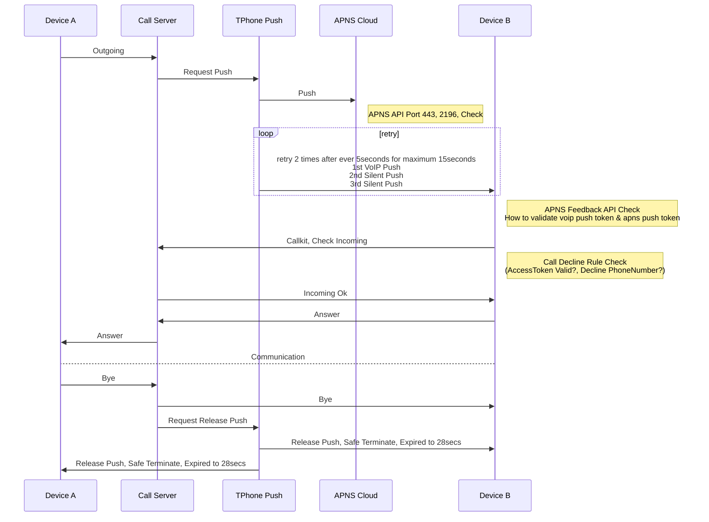

```mermaid
sequenceDiagram
Device A ->> Call Server: Outgoing
Call Server ->> TPhone Push: Request Push
TPhone Push ->> APNS Cloud: Push
Note right of APNS Cloud: APNS API Port 443, 2196, Check
loop retry
    TPhone Push->>Device B: retry 2 times after ever 5seconds for maximum 15seconds<br>1st VoIP Push<br>2nd Silent Push<br>3rd Silent Push
end
Note right of Device B: APNS Feedback API Check<br>How to validate voip push token & apns push token
Device B ->> Call Server: Callkit, Check Incoming
Note right of Device B: Call Decline Rule Check<br>(AccessToken Valid?, Decline PhoneNumber?)
Call Server ->> Device B: Incoming Ok
Device B ->> Call Server: Answer
Call Server ->> Device A: Answer
Device B --> Device A: Communication
Device A ->> Call Server: Bye
Call Server ->> Device B: Bye
Call Server ->> TPhone Push: Request Release Push
TPhone Push ->> Device B: Release Push, Safe Terminate, Expired to 28secs
TPhone Push ->> Device A: Release Push, Safe Terminate, Expired to 28secs

```
